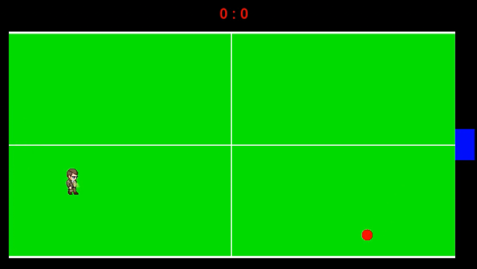

# sfml-pong
Simple ping-pong game with AI in SFML

 🚀 **My First Ever Developed Game: Created with SFML in C++** 🎮 
 
 I've been working on my first game, and here's a sneak peek of the prototype! 🕹️ It’s a mix of **Pong-inspired mechanics** with a twist: you control a character on the field to interact with the ball.
 
 ### 🎯 Key Features So Far:  
 - Dynamic player movement with a character sprite  
 - Animations for the character  
 - Ball physics system for exciting gameplay 🔴  
 - Competitive scoring system displayed at the top 😉  
 - Opponent mechanics (that blue block is smarter than it looks—it's an AI agent!)  

